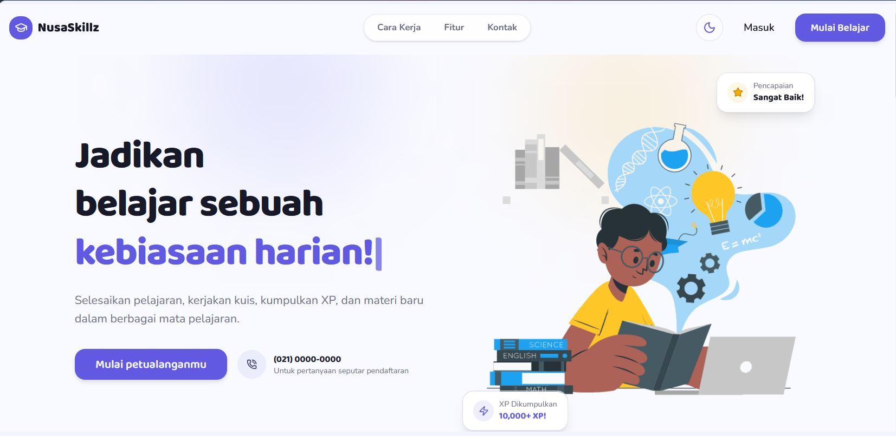
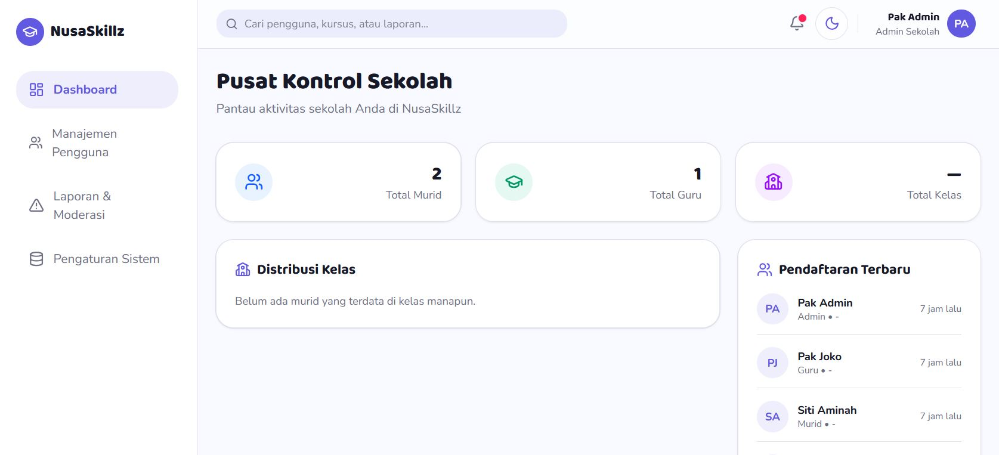
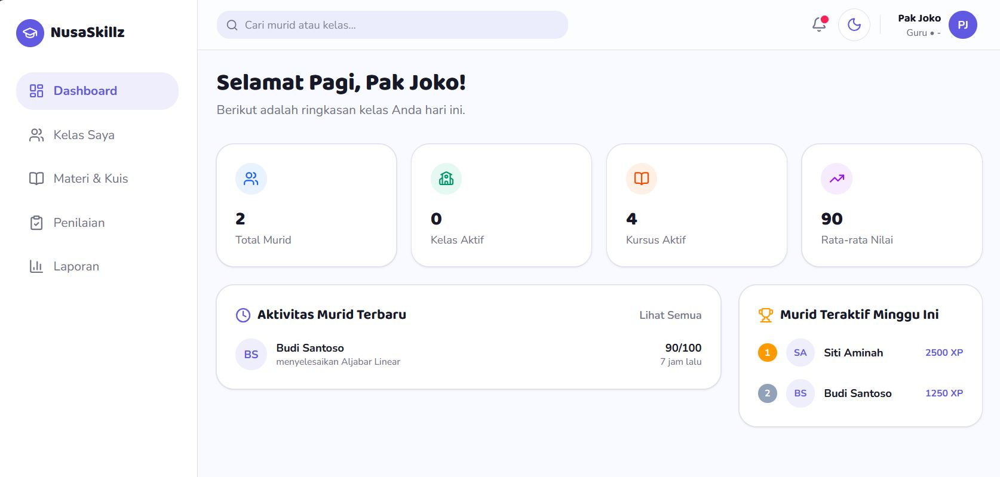
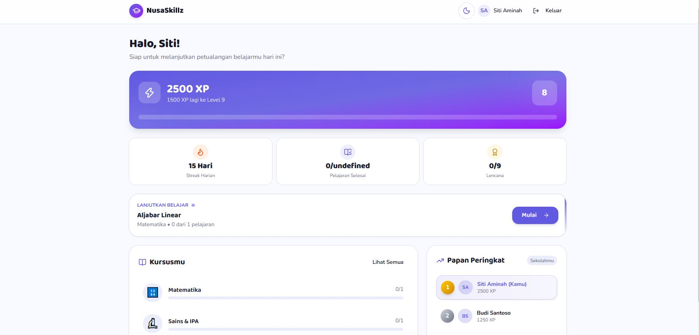
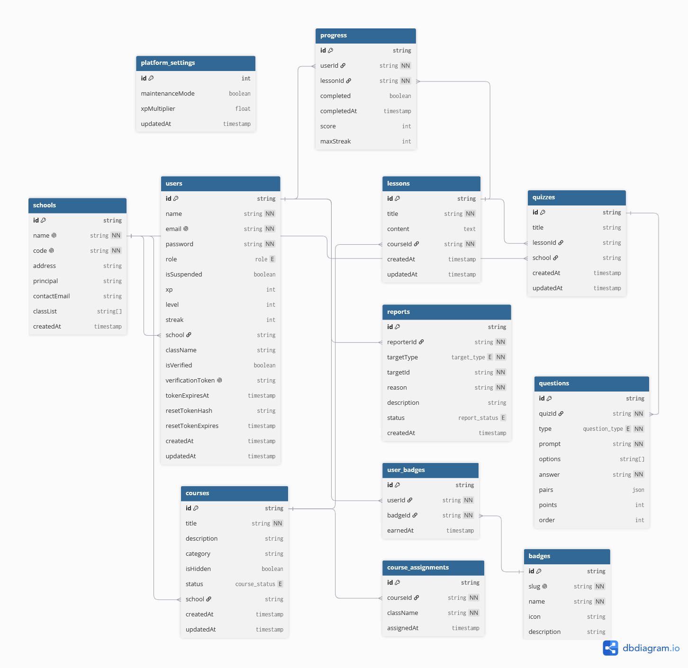

# NusaSkillz

NusaSkillz is a gamified learning platform for Indonesian students, teachers, schools, and administrators. Students can work through courses and lessons, complete quizzes, earn XP, collect badges, and maintain learning streaks. Teachers and administrators get role-specific dashboards for managing classes, materials, grading, reports, users, and moderation.
The frontend is built with Next.js App Router, React, TypeScript, Tailwind CSS, and Lucide icons. User authentication and dashboard data are currently provided by a separate API service running on port `3001`.

## Features
- Student registration, email verification, sign-in, and password recovery flows
- Gamified learning experience with XP, levels, badges, streaks, and leaderboards
- Student dashboards, course browsing, and lesson pages
- Teacher dashboards for classes, materials, grading, reports, and settings
- Admin dashboards for users, reports, moderation, and settings
- Super administrator dashboard and school management views
- Responsive interface with light and dark themes
- Route protection and role-based redirects through Next.js middleware

## Tech Stack
- Next.js 16 with the App Router
- React 19 and TypeScript
- Tailwind CSS 4
- Lucide React for icons
- ESLint and Next.js production tooling

## Requirements
- Node.js 20 or newer
- npm
- The NusaSkillz API service running at `http://localhost:3001`

Start the API service before testing registration, sign-in, or authenticated dashboard features.

The API URL can be configured with the `NEXT_PUBLIC_API_URL` environment variable. If it is not set, the frontend uses `http://localhost:3001`.
## Getting Started

Install the dependencies:

```bash
npm install
```

Create a `.env.local` file when the API is running somewhere other than the default local URL:

```env
NEXT_PUBLIC_API_URL=http://localhost:3001
```

Start the development server:

```bash
npm run dev
```

Open the frontend at [http://localhost:3000](http://localhost:3000). For access to the full application, make sure the backend is available at the URL configured in `NEXT_PUBLIC_API_URL`.

## Available Scripts

| Command | Description |
| `npm run dev` | Start the development server on port 3000 |
| `npm run build` | Create a production build |
| `npm run start` | Start the production server |
| `npm run lint` | Run ESLint |

## Main Routes
| Area | Routes |
| --- | --- |
| Public | `/`, `/sign-in`, `/sign-up`, `/forgot-password`, `/reset-password` |
| Student | `/student/dashboard`, `/student/courses`, `/student/lesson` |
| Teacher | `/teacher/dashboard`, `/teacher/classes`, `/teacher/materials`, `/teacher/grading`, `/teacher/reports`, `/teacher/settings` |
| Admin | `/admin/dashboard`, `/admin/users`, `/admin/reports`, `/admin/settings` |
| Super admin | `/super/dashboard`, `/super/schools` |

Protected routes require a valid authentication token. The middleware redirects users to the dashboard for their role and prevents access to areas they are not authorized to view.

## Frontend

Run the frontend locally at [http://localhost:3000](http://localhost:3000). It is also available online at [the NusaSkillz frontend deployment](https://crack-fe-setiawanhennie-glitch-768jug6g8-hennie-s-projects.vercel.app/).

## Screenshots

The repository currently includes the following visual asset, which includes:
1. The Homepage


2. Admin Dashboard Overview


3. Teacher Dashboard Overview


4. Student Dashboard Overview


## ERD Diagram
Relational ERD diagram of the database is as shown below.


## Project Structure

```text
src/
├── app/          Next.js pages, layouts, and route groups
├── components/   Reusable UI and home page components
├── lib/          Authentication and shared utilities
└── middleware.ts Authentication and role-based route protection
```

## Production
Build and run the production frontend with:

```bash
npm run build
npm run start
```

Before deployment, set `NEXT_PUBLIC_API_URL` to the API URL for the target environment in the hosting provider's environment variables. Do not edit `src/lib/auth-client.ts` for deployment configuration. Ensure the backend allows requests from the deployed frontend origin.

## Learn More

- [Next.js documentation](https://nextjs.org/docs)
- [Next.js App Router documentation](https://nextjs.org/docs/app)
- [Tailwind CSS documentation](https://tailwindcss.com/docs)
